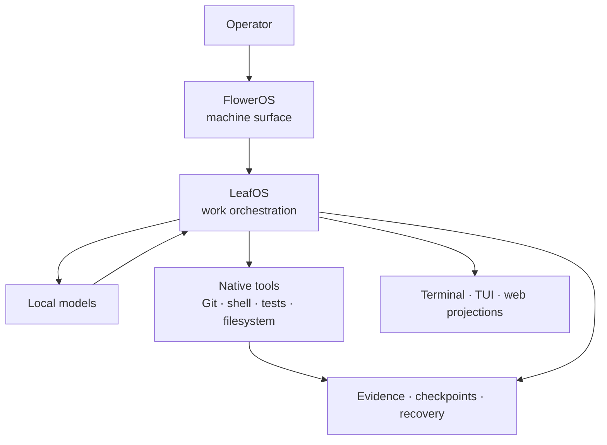
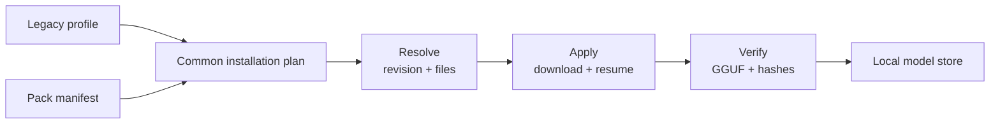

<div align="center">

# 🍃 LeafOS

### Local models. Durable work. Native proof.


<!-- leafos-program:brand-asset:start -->

<!-- leafos-program:brand-asset:end -->

**An experimental local orchestration and durability stack for bounded, inspectable, resumable work.**

</div>

---

LeafOS manages local model work, routing, native authority, evidence, checkpoints, recovery, and terminal or web projections.

**FlowerOS** is the operator-facing machine surface.
**LeafOS** controls the work performed on that machine.

> [!IMPORTANT]
> This repository is an **organic, partially working 0.2.3 snapshot**.
>
> It contains functional subsystems, active architecture, known regressions, and unfinished integrations. It is a visible development record, not a polished release or a declaration that every diagram has achieved physical existence.

```text
Intent enters.
State persists.
Models interpret.
Native tools prove.
```

## System shape



```text
FlowerOS controls the machine.
LeafOS controls the work.
Native tools prove.
Models interpret.
State outranks conversation.
```

## Current shape

| Area         | Present state                                                           |
| ------------ | ----------------------------------------------------------------------- |
| CLI surfaces | PowerShell and Bash entry points                                        |
| Models       | Local planning, installation, resolution, and verification              |
| Machine view | FlowerOS terminal presentation and hardware monitoring                  |
| Runtime      | Durable Monday Rescue and Analysis instance                             |
| State        | Append-only evidence, capability, checkpoint, and recovery contracts    |
| Workflows    | Project intake, task loops, benchmarks, tests, TUI, and web projections |
| Packs        | Profile and pack manifests using a shared installation pipeline         |

The governing design is the [Continual Bloom Primary Reference](LEAFOS-CONTINUAL-BLOOM-PRIMARY-REFERENCE.md).

The current repository boundary is defined in the [Root Contract](markdowns/ROOT_CONTRACT.md).

## Start here

### README and version program

Run `program` without arguments for an interactive menu. It keeps the local
brand asset verified, updates any README beneath this root without duplicating
the managed image block, and synchronizes LeafOS version authorities.

```powershell
.\program.ps1
.\program.ps1 status
.\program.ps1 update-readme README.md --yes
.\program.ps1 change-version 0.2.3 --check
```

```bash
bash program.sh
bash program.sh status
bash program.sh update-readme README.md --yes
bash program.sh change-version 0.2.3 --check
```

Use `--check` to preview any README or version update. The permanent image is
content-addressed and checked against
[`assets/brand/immutable/manifest.json`](assets/brand/immutable/manifest.json)
before a README operation can write.

### Windows PowerShell

```powershell
cd C:\path\to\LeafOS

# concise command card
.\leafos.ps1 q

# runtime status
.\leafos.ps1 status

# installation and dependency readiness
.\leafos.ps1 doctor

# durable Monday instance
.\leafos.ps1 b
```

### Bash or WSL

```bash
bash leafos.sh q
bash leafos.sh status
bash leafos.sh doctor
```

> [!WARNING]
> Model weights are never included in this repository.
>
> Installer operations are plan-first and must not cross the download boundary without explicit confirmation. Apparently downloading tens of gigabytes deserves slightly more ceremony than installing a color theme.

## Command surface

| Command        | Purpose                                    | Mutates state |
| -------------- | ------------------------------------------ | :-----------: |
| `q`            | Show the concise command card              |       No      |
| `h`            | Open the operator Home                     |       No      |
| `s` / `status` | Show fast runtime status                   |       No      |
| `d` / `doctor` | Check installation readiness               |       No      |
| `r`            | Show the active runtime selection          |       No      |
| `p`            | Inspect the local model provider           |       No      |
| `t`            | Inspect the latest observable run trace    |       No      |
| `ref`          | Locate primary Markdown and TeX references |       No      |
| `b`            | Show the durable Monday instance           |       No      |
| `m`            | Open CPU, memory, and disk monitoring      |       No      |
| `c`            | Open local model chat                      |      Yes      |
| `go`           | Start guided project onboarding            |      Yes      |

Most commands are intentionally read-only. LeafOS should be able to explain itself before it begins rearranging someone’s repository with machine confidence.

### Scientific change loop

The implemented CCIS foundation is available through both root command
surfaces. It owns typed tasks, deterministic allocation, evidence integrity,
and explicit acceptance; the nested Scientific Change Loop consumes those
contracts without creating another task authority.

```powershell
.\leafos.ps1 ccis --help
.\leafos.ps1 ccis status --run PATH
.\leafos.ps1 task accept TASK_ID
```

The llama.cpp task types are intentionally registered without native handlers.
WO-053 must prove binary, model, and backend capability before WO-054 performs
grammar-bound inference or WO-055 starts an owned streaming server. Existing
provider configuration and mock transport are discovery inputs, not evidence
that those work orders have passed.

## What currently works

* PowerShell and Bash root entry surfaces
* concise command discovery
* runtime and readiness inspection
* local provider checks
* live CPU, memory, disk, and download monitoring
* durable Monday runtime state
* local model chat
* guided project onboarding
* profile-based model installation
* pack-aware model installation
* offline installation planning
* repository and filename resolution
* resumable Hugging Face downloads
* GGUF and optional hash verification
* append-only evidence and recovery contracts
* original bounded Continual Bloom tests

## Installation architecture

Legacy profiles and model packs enter through different planning commands, then converge on the same installer pipeline.



### Safe profile plan

```powershell
.\PowerShell-Version\real-models.ps1 `
  -Profile runtime-default
```

### Resolve and install a profile

```powershell
.\PowerShell-Version\real-models.ps1 `
  -Profile runtime-default `
  -Resolve `
  -Apply `
  -Yes
```

### Safe pack plan

```powershell
.\PowerShell-Version\real-models.ps1 `
  -Pack ProjectLeaf\leafos_taskpack\config\packs\viola-nocturne.json
```

### Resolve and install a pack

```powershell
.\PowerShell-Version\real-models.ps1 `
  -Pack ProjectLeaf\leafos_taskpack\config\packs\viola-nocturne.json `
  -Resolve `
  -Apply `
  -Yes
```

Matching catalog keys and quantizations are deduplicated. Fifteen pack roles therefore do not automatically require fifteen separate downloads, sparing the storage device from participating in the model bureaucracy.

<details>
<summary><strong>Monitor a running download</strong></summary>

```powershell
.\leafos.ps1 vtop --duration-seconds 10
```

Or follow the download log:

```powershell
Get-Content viola-download.log -Tail 20 -Wait
```

</details>

## Honest snapshot status

The root contract currently validates on both PowerShell and Bash. The original bounded Continual Bloom tests also pass.

The broader integration is not yet green.

| Result | Count |
| ------ | ----: |
| Passed |   214 |
| Failed |    10 |
| Errors |    49 |
| Total  |   273 |

```text
Passing   ███████████████████████████████░░░░░░░░ 214
Failing   ██                                         10
Errors    ███████                                    49
```

> [!NOTE]
> These numbers describe the latest complete local run recorded for this snapshot. They should be replaced when a newer complete run is demonstrated.

<details>
<summary><strong>Known regressions and integration drift</strong></summary>

* The PowerShell installer currently bypasses the richer historical animation layer.
* Authority-bridge tests are not isolated from the default Monday journal.
* A duplicate in-memory append can produce a transcript sequence gap.
* Model-profile contracts have drifted from their tests.
* Shortcut contracts have drifted from their tests.
* Catan2 and USB integration contracts have drifted.
* Some Bash environment assumptions no longer match their test fixtures.

These issues are published rather than hidden because visible history and disciplined stabilization are more useful than another private rewrite followed by an extremely confident README.

</details>

## Stabilization focus

* [x] Preserve the working root command surfaces
* [x] Keep profiles and packs on one installer pipeline
* [x] Retain plan-first model installation
* [x] Preserve resumable model downloads
* [ ] Restore the unified animated installation frontend
* [ ] Isolate authority-bridge tests from live Monday state
* [ ] Remove duplicate transcript sequence gaps
* [x] Reconcile conflicting version files and enforce agreement in both root validators
* [ ] Bring profile, shortcut, USB, Catan2, and Bash contracts back in sync
* [ ] Demonstrate the complete project work loop from the CLI

## Operational direction

LeafOS is being simplified around one complete loop:


The current priority is not accumulating more configuration, model titles, or speculative orchestration layers.

The priority is making LeafOS:

* simpler to operate;
* easier to inspect;
* safer to resume;
* clearer when it fails;
* more concise internally;
* pleasant enough to use repeatedly.

Advanced routing, multi-model review, lifecycle structures, and long-duration autonomy remain welcome experiments, but they must operate above the stable core rather than replacing it.

## Repository boundary

<details>
<summary><strong>Included in the public source tree</strong></summary>

* source code;
* tests;
* schemas;
* configuration;
* pack manifests;
* documentation;
* bounded fixtures;
* architecture references.

</details>

<details>
<summary><strong>Excluded from the public source tree</strong></summary>

* model weights;
* Hugging Face download caches;
* virtual environments;
* compiled binaries;
* live runtime state;
* private journals;
* logs;
* generated reports;
* temporary plans;
* local scratch work.

</details>

## Project map

```text
LeafOS/
├── leafos.ps1
├── leafos.sh
├── program.ps1
├── program.sh
├── assets/brand/immutable/
├── PowerShell-Version/
│   └── real-models.ps1
├── ProjectLeaf/
│   ├── leaf_model_installer/
│   │   └── leaf_models/
│   └── leafos_taskpack/
│       ├── bin/
│       ├── config/
│       ├── core/
│       └── tests/
├── markdowns/
│   └── ROOT_CONTRACT.md
└── LEAFOS-CONTINUAL-BLOOM-PRIMARY-REFERENCE.md
```

## Design boundary

LeafOS keeps several concepts deliberately separate:

| Concept       | Meaning                                         |
| ------------- | ----------------------------------------------- |
| Pack identity | Name, flower, color, and display symbol         |
| Capability    | Work a model or tool can perform                |
| Assignment    | What the current request asks it to do          |
| Persona       | How a model communicates                        |
| Runtime state | Active, blocked, resumable, failed, or complete |
| Evidence      | What native tools and durable records can prove |

A flower name is not a trust score. A persona is not a routing policy. A model calling itself a judge has not, through the miracle of JSON, become legally authoritative.

## Documentation

* [Continual Bloom Primary Reference](LEAFOS-CONTINUAL-BLOOM-PRIMARY-REFERENCE.md)
* [Root Contract](markdowns/ROOT_CONTRACT.md)
* [Project Markdown Index](markdowns/)
* [LeafOS taskpack](ProjectLeaf/leafos_taskpack/)
* [Model installer](ProjectLeaf/leaf_model_installer/)

## License status

Some contained components carry their own MIT licenses.

A repository-wide license has not yet been selected. Files outside independently licensed components remain under normal copyright rules.

Do not assume that the presence of public source automatically grants permission to redistribute every file. Git hosting remains stubbornly distinct from legal clairvoyance.

---

<div align="center">

### Intent in. Evidence out.

**LeafOS controls the work.**

</div>
